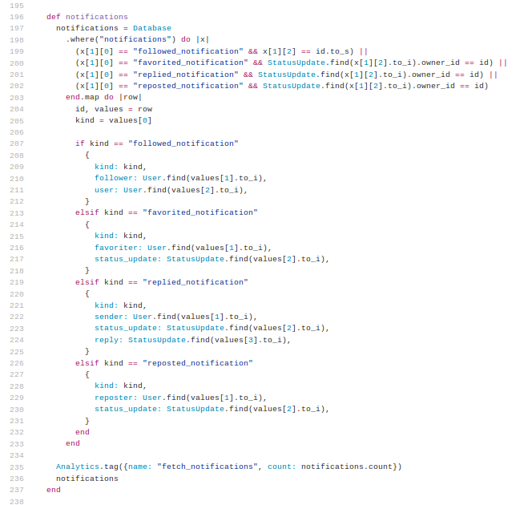

# Explorative Test-Driven Development

by That TDD Fellow

Oleksii Fedorov

[@waterlink000](https://twitter.com/waterlink000)

Note:
Welcome everyone, thank you for having me here. I am Oleksii Fedorov and today I am going to talk about the technique, that helps me to work with Legacy Code bases and helps me with big refactorings. It is called Explorative Test-Driven Development. Today I am going to cover the following...


- Code <- Test Relationship
- Knowledge Coverage Verification
- Code -> Test Relationship
- Mutational Testing Technique
- Explorative TDD Technique
- Example
- Bottom Line

Note:
Code examples will be in Ruby, but the technique described today is language- and paradigm- -agnostic.
Fell free to interrupt me and ask questions at any point. Shall we get started?


## Code <- Test Relationship


Production code is the most important part


Test suite makes sure production code is correct


Test suite enables easy refactoring


Test suite gives courage to introduce a change

Note:
Such as new feature, bug fix, etc.


Test suite is coupled to the code it tests


Note:
Given that information, I was always wondering if it is possible to consistently and confidently verify if knowledge in production code is well-tested. And that leads us to the next point...


## Verifying knowledge coverage

Note:
Just to rephrase it:
How can one verify if specific knowledge in production code is covered by test suite?


### Knowledge in Production Code?

```ruby
# this is a knowledge
variable_name = some.value(from, other, source)
```

Note:
Wait, what is the "knowledge in code" was again?


```ruby
if <knowledge>
...
```

```ruby
if ...
  <knowledge>
...
```

```ruby
...
elsif <knowledge>
...
```

```ruby
...
else
  <knowledge>
end
```


```ruby
something.doAction(this, is, a, knowledge, too)
```

```ruby
return <knowledge>
```


```ruby
<knowledge>.each do |item|
  ...
end
```

```ruby
....each do |item|
  <knowledge>
end
```


### Got it. How to verify it?


### Break it.

Note:
Introduce a very small change to the knowledge. The test suite should fail.
If it doesn't - knowledge is not covered well enough.
Now that we know what the knowledge in production code is, let's think how this knowledge affects our test suite.
That leads us to the next point...


## Code -> Test Relationship


Knowledge in the production code should be verified by test suite


Knowledge change is an act of verification if test suite is correct

Note:
(or thorough enough)


Knowledge change is a test for the test.

Note:
Such "knowledge changes" are usually called Mutations. And that leads us to the technique called...


## Mutational testing


1. Narrow scope to single granular piece of knowledge
2. Break this knowledge (simple change, Mutation)
3. Make sure there is a test suite failure
4. Restore knowledge to the original state

Note:
I think this is a good time to have some questions...
I always felt that it should be possible to apply Mutational Testing to support the process of understanding the Legacy Code. That is where I started to notice, how experienced engineers deal with untested code. I was able to aggregate it to the technique called Explorative Test-Driven Development...


## Explorative TDD

The technique used to increase code coverage and understanding of the knowledge in the code.


1\. Narrow scope to some manageable knowledge and isolate it

Note:
*(manageable knowledge = method/function/class/module)*


2\. Read and try to understand one piece of knowledge


3\. Write a test to verify this assumption


4\. Make sure it passes

Note:
by altering the assumption, or fixing production code (bugs)


5\. Apply Mutational Testing repeatedly

Note:
Apply Mutational Testing to each related granular piece of knowledge to verify that the understanding (and the test) is correct
(this may introduce more tests)


6\. Go back to 2


### Recap

1. Narrow scope and isolate it
2. Read, try to understand, pick granular piece of knowledge
3. Write a test
4. Make sure test passes
5. Apply Mutational Testing repeatedly
6. Go back to 2

NOTE:
I think this is a good time to have some questions...
I think we should go through a small example...


## I want to see it in action!

*(step-by-step example)*


### Narrow & Isolate


Means of isolation:

- Extract completely to module/class/package of its own.
- Duplicate the code under the test and put it into function/method(s) with
  different distinguishable name.


#### Our scope





### Step 1: Duplicate code to different method

```ruby
class User
  def notifications
    notifications = Database
      .where("notifications") do |x|
    ...
  end

  # full copy of User#notifications
  def notifications__isolated__
    notifications = Database
      .where("notifications") do |x|
    ...
  end
end
```


### Step 2: Read, try to understand and pick knowledge to test

```ruby
(x[1][0] == "followed_notification" && x[1][2] == id.to_s) ||
...
```

```ruby
if kind == "followed_notification"
  {
    kind: kind,
    follower: User.find(values[1].to_i),
    user: User.find(values[2].to_i),
  }
elsif ...
```


### Step 3: Write the first test

```ruby
it "looks like it loads some notifications from the database" do
  user = User.new(email: "john@example.org", password: "welcome")
  Database.insert("notifications", [
    "followed_notification", "986", user.id.to_s]
  )

  notifications = user.notifications__isolated__

  expect(notifications.count).to eq(1)
end
```


### Step 4: Make sure test passes

```
.

Finished in 0.02343 seconds (files took 0.11584 seconds to load)
1 example, 0 failures
```


### Step 5: Apply Mutational Testing repeatedly

```ruby
(x[1][0] == "followed_notification" && x[1][2] == id.to_s) ||
...
```

```ruby
if kind == "followed_notification"
  {
    kind: kind,
    follower: User.find(values[1].to_i),
    user: User.find(values[2].to_i),
  }
elsif ...
```


Break first granular piece of knowledge:

```ruby
# (x[1][0] == "followed_notification" && x[1][2] == id.to_s) ||
...
```


And run tests:

```
F

Failures:

  1) User#notifications looks like it loads some notifications from the database
     Failure/Error: expect(notifications.count).to eq(1)

       expected: 1
            got: 0

       (compared using ==)
     # ./lemon_spec.rb:63:in `block (3 levels) in <top (required)>'

Finished in 0.03511 seconds (files took 0.11877 seconds to load)
1 example, 1 failure
```


Great. This mutation says, that our tests are good to go. Other options:

- replace condition with `false`
- replace condition with `true`


Replacing condition with `true` results in:

```
.

Finished in 0.02343 seconds (files took 0.11584 seconds to load)
1 example, 0 failures
```


Now we have to either:

- change our understanding if it is not what we expect, or
- change our test to cover that, or
- add more tests.


Adding another test does the job:

```ruby
it "ignores records of an invalid kind" do
  user = User.new(email: "john@example.org", password: "welcome")
  Database.insert("notifications", [
    "invalid", "986", user.id.to_s
  ])

  notifications = user.notifications__isolated__

  expect(notifications.count).to eq(0)
end
```


```
.F

Failures:

  1) User#notifications ignores records of invalid kind
     Failure/Error: expect(notifications.count).to eq(0)

       expected: 0
            got: 1

       (compared using ==)
     # ./lemon_spec.rb:131:in `block (3 levels) in <top (required)>'

Finished in 0.21531 seconds (files took 0.11582 seconds to load)
2 examples, 1 failure
```


Undo the mutation:

```ruby
(x[1][0] == "followed_notification" && x[1][2] == id.to_s) ||
...
```

and run tests:

```
..

Finished in 0.02343 seconds (files took 0.11584 seconds to load)
2 examples, 0 failures
```


### Apply Mutational Testing repeatedly


```ruby
...
kind = values[0]
...
```

change to

```ruby
...
kind = values[1]
...
```


And run tests:

```
..

Finished in 0.02343 seconds (files took 0.11584 seconds to load)
2 examples, 0 failures
```


Another non-failing mutation, let's add test:

```ruby
it "loads followed notifications with a correct kind" do
  user = User.new(email: "john@example.org", password: "welcome")
  Database.insert("notifications", [
    "followed_notification", "986", user.id.to_s
  ])

  notifications = user.notifications__isolated__

  expect(notifications[0][:kind]).to eq("followed_notification")
end
```


And run tests:

```
..F

Failures:

  1) User#notifications loads followed notifications with correct kind
     Failure/Error: expect(notifications[0][:kind]).to eq("followed_notification")

     NoMethodError:
       undefined method `[]' for nil:NilClass
     # ./lemon_spec.rb:72:in `block (3 levels) in <top (required)>'

Finished in 0.14636 seconds (files took 0.12127 seconds to load)
3 examples, 1 failure
```

Which is what we expect!


Undo mutation and run tests:

```
...

Finished in 0.14636 seconds (files took 0.12127 seconds to load)
3 examples, 0 failures
```


### Continue applying mutational testing

(until there is enough confidence)


### Go back to step 2 and repeat

(until there is enough confidence)


This step-by-step example can be viewed as commit history here:

https://github.com/waterlink/lemon/pull/6


Note:
This concludes our example and I think it is time for questions...
With that done, we should see, if that technique can be used outside of the context of Legacy Code...


## Outside of the context of Legacy Code


Useful during big refactorings

(extract class/module/package)


Useful when refactoring tests

- verify that test suite is still correct after refactoring
- verify that test suite is not rigid (and identify parts requiring refactoring)

*(rigid = one change -> 70% tests fail)*

Note:
Let's recap the technique itself and draw a bottom line.


## Recap & Q & A

1. Narrow scope and isolate it
2. Read, try to understand, pick granular piece of knowledge
3. Write a test
4. Make sure test passes
5. Apply Mutational Testing repeatedly
6. Go back to 2

Note:
It is time for questions now.


## Thank you

Twitter: [twitter.com/waterlink000](https://twitter.com/waterlink000)

Github: [github.com/waterlink](https://github.com/waterlink)

Blog: [tddfellow.com](http://tddfellow.com)
